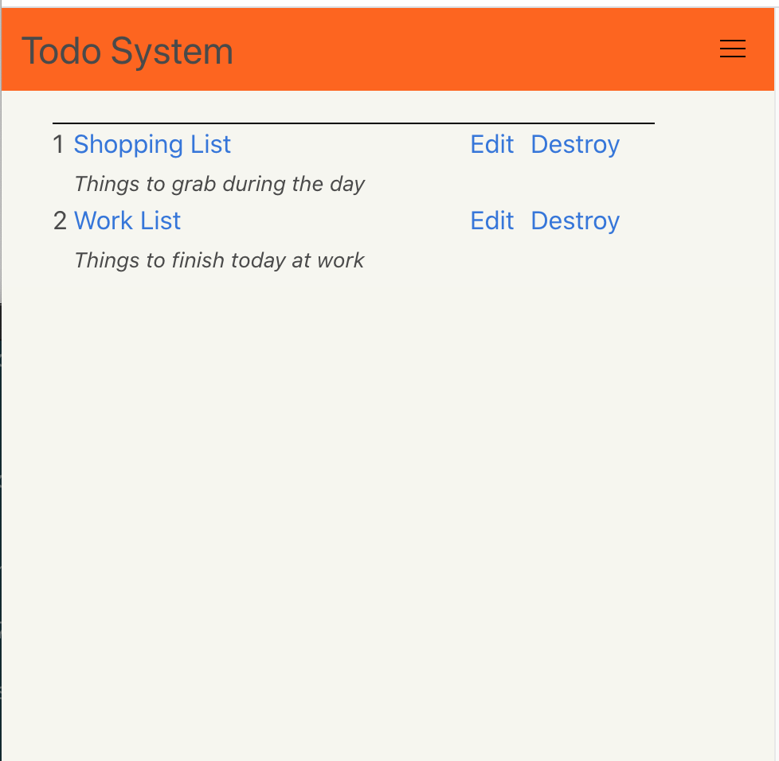

# Rails Todo System

# Starting the local development server

I use a `Procfile` however since Heroku makes use of the same pattern, I usually create a `Procfile.dev` 
specific version in my Rails projects. 

Here's how to run it via Foreman.

- `gem install foreman`
- `foreman start -f Procfile.dev`

This README would normally document whatever steps are necessary to get the
application up and running.

Things you may want to cover:

* Ruby version

* System dependencies

* Configuration

* Database creation

* Database initialization

* How to run the test suite

* Services (job queues, cache servers, search engines, etc.)

* Deployment instructions

* ...
